> Reference: A. Aldhafeeri and Y. Rahmat-Samii, "Brain Storm Optimization for Electromagnetic Applications: Continuous and Discrete," _IEEE Transactions on Antennas and Propagation_, vol. 67, no. 4, pp. 2710-2722, 2019.

<!--truncate-->

## Motivation

Everyone knows what's going on... 🤪

## Method

### Concept

> Brainstorming is a widely used method to facilitate creative
> thinking among a group of people.

> Brain storm optimization (BSO) is a swarm intelligence
> optimization algorithm inspired by the collective behavior
> of human beings in solving problems.

The concept of BSO is that the brainstorming process starts with
$N$ ideas generated by $N$ individuals. Then, the ideas are
grouped into $M$ groups based on similarity, and the best idea
in each group is determined. Finally, new $N$ ideas are generated
based on Osborn’s four original rules:

1. **Suspend Judgment**: This rule says that there is no such
thing as a bad idea. This rule encourages people to
produce ideas more often without having to worry about
being criticized. Therefore, this rule can significantly
help increase the diversity of ideas.
2. **Anything Goes**: This rule states that all ideas need to
be shared. This helps generate unusual ideas. Rule 2
supplements Rule 1 in generating diverse idea and avoid
being trapped in a box.
3. **Cross-Fertilize**: This rule calls for new ideas to be
generated from a combination of existing (or previously
generated) ideas to increase the diversity of inputs.
4. **Go for Quantity**: This rule states that it is desirable to
maximize the number of ideas under consideration. Having
many ideas to choose from increases the probability
of achieving a high-quality solution.

### BSO algorithm

1. **Population Initialization**:  
    A population $X$ of $N$ individuals or ideas is generated
    in a $D$-dimensional search space.
1. **Clustering Ideas**:  
    The $N$ ideas are divided into $M$ groups based on
    their location in the search space such that ideas
    that are closer to each other belong to the same cluster.
1. **Rank Ideas**:  
    After evaluating ideas using a predefined fitness function, 
    ideas are ranked in each cluster. The best idea in each 
    cluster is selected to be the cluster center.
4. **Disrupting Cluster Center**:  
    To avoid deception and increase population diversity,
    we occasionally replace a cluster center with
    a randomly generated idea.
5. **Updating Ideas**:  
    New ideas are generated based on either one cluster
    or two clusters.

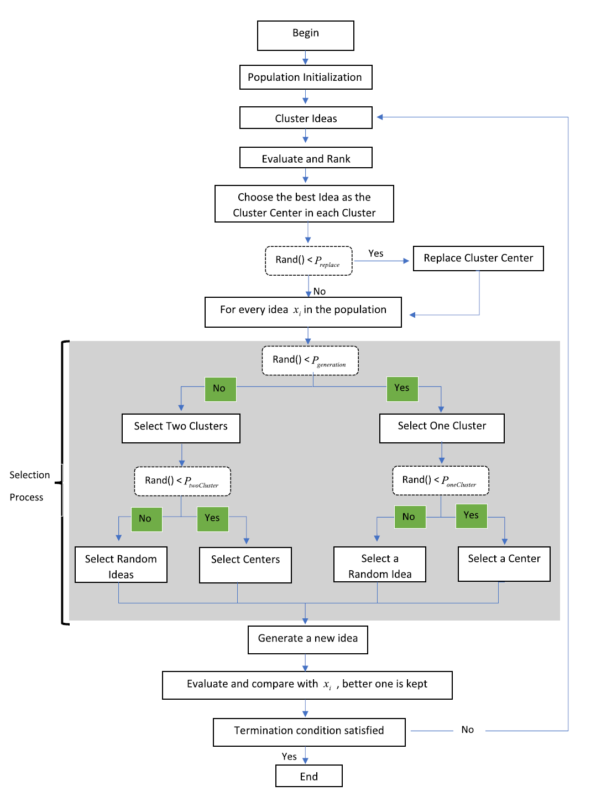
Fig. 1. Flowchart of the BSO algorithm

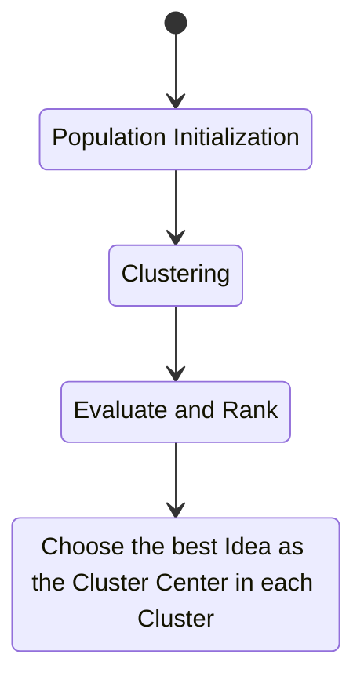

## Example

### Benchmark

Skip

### Six-element Yagi-Uda antenna

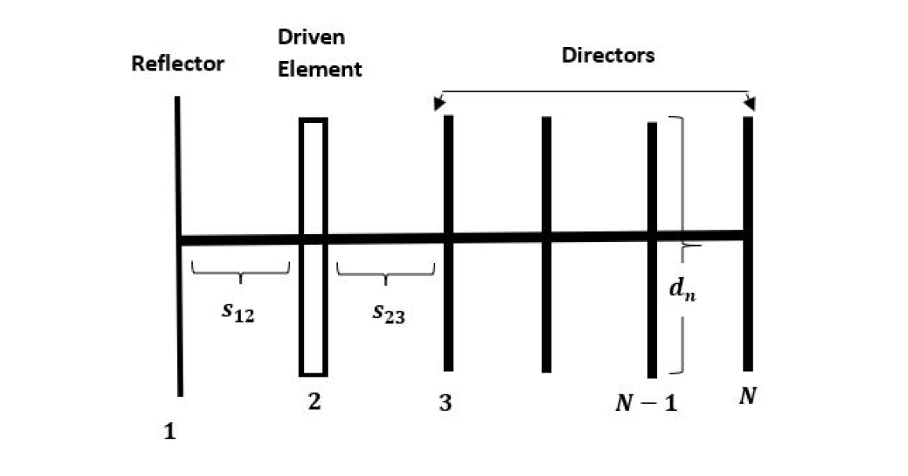
Fig. 2. Yagi-Uda antenna configuration

- **Comparision**: BSO, GA and PSO
- **Target**: Radiation pattern
    - maximizing directivity
    - maximizing front-to-back ratio

**Fitness function**:
$$
F_{\text{Yagi}} = (13.5-D)^2-F/B
$$

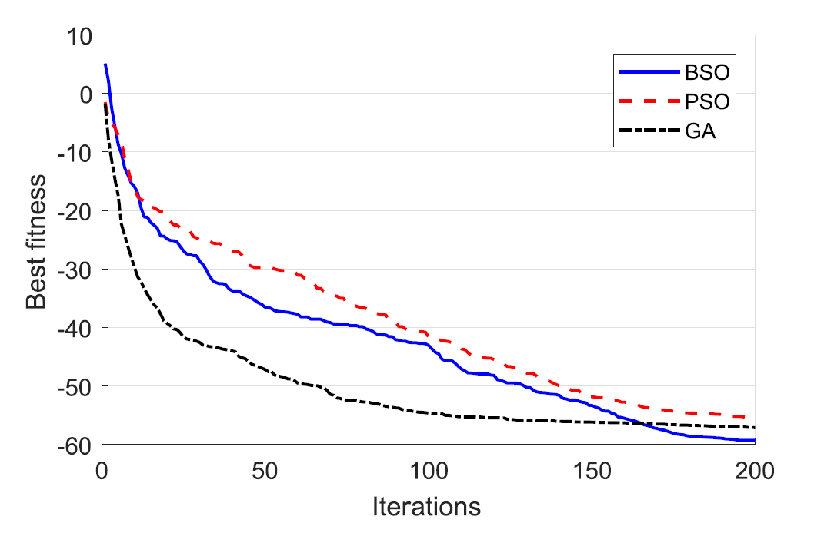
Fig. 3. Average fitness of 25 runs of the Yagi-Uda antenna design

### Five-Shell Nonuniform Luneburg Lens

A Luneburg lens is a symmetrical dielectric sphere having
a refractive index which decreases radially outward from its
center. The dielectric constant $\varepsilon$ of an ideal
Luneburg lens starts from 2 at the center of the sphere then
continuously decreases to 1 at the outer surface. The behavior
of permittivity of the sphere is expressed as

$$
\varepsilon(r) = 2 - \left(\frac{r}{a}\right)^2 \text{,}
\quad 0\leqslant r\leqslant a
$$

In practice, the Luneburg lens is constructed using a discrete
number of homogeneous spherical shells that have the same
behavior of decreasing permittivity from inner-most shell to
outer-most shell.

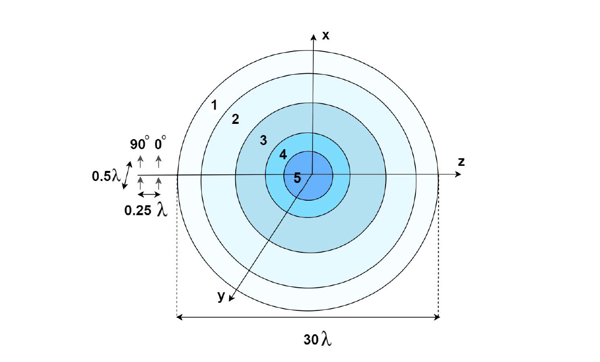
Fig. 4. Luneburg lens antenna configuration

- **Comparision**: BSO, GA and PSO
- **Target**: Gain
    - minimizing sidelobe levels
    - maximizing boresight gain 

Comparing the gain envelope to a ten-shell Luneburg lens,
whose envelope function in the sidelobe region is developed as

$$
f_{\text{env}} = 12 - 38\log\left(\frac{\theta^\degree}{5.8^\degree}\right)\text{(dB),}
\quad 2.5^\degree\leqslant\theta\leqslant 35^\degree
$$

**Fitness function**:
$$
F_{\text{lens}} = (40 - G_0)^2 + (E)^2
$$
where
$$
E = \frac{1}{N}\sum_{i=1}^{N}[G(\theta_i) - f_{\text{env}}(\theta_i)]
$$

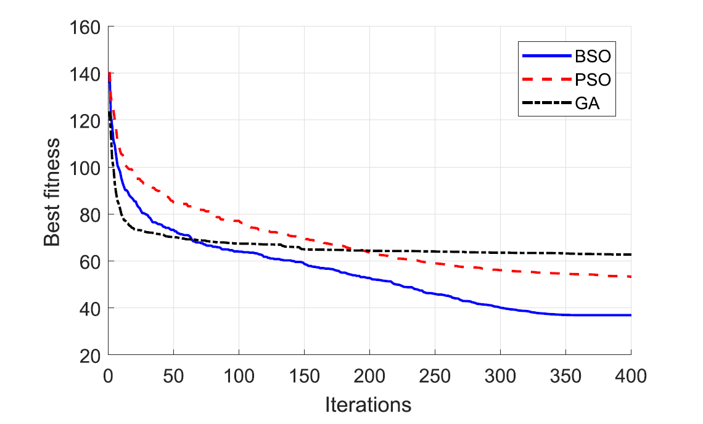
Fig. 5. Average fitness of 25 runs of a five-shell 30$\lambda$
diameternonuniform spherical lens antenna design.

### Slotted Patch

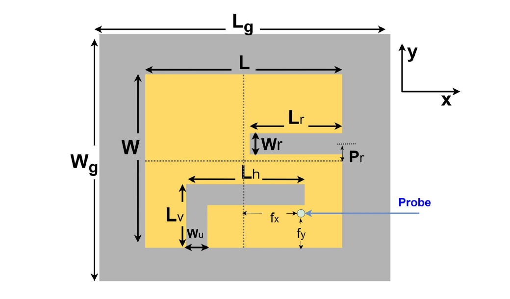
Fig. 6. Coaxial probe-fed slotted rectangular patch.

- **Comparision**: BSO
- **Target**: Scattering parameter
    - $S_{11}$ at two of the desired bands of interest
      (1.9 and 2.4 GHz)

**Fitness function**:
$$
F_{\text{slotted}} = \max(S_{11}|_{f=1.9\text{ GHz}},
S_{11}|_{f=2.4\text{ GHz}})
$$

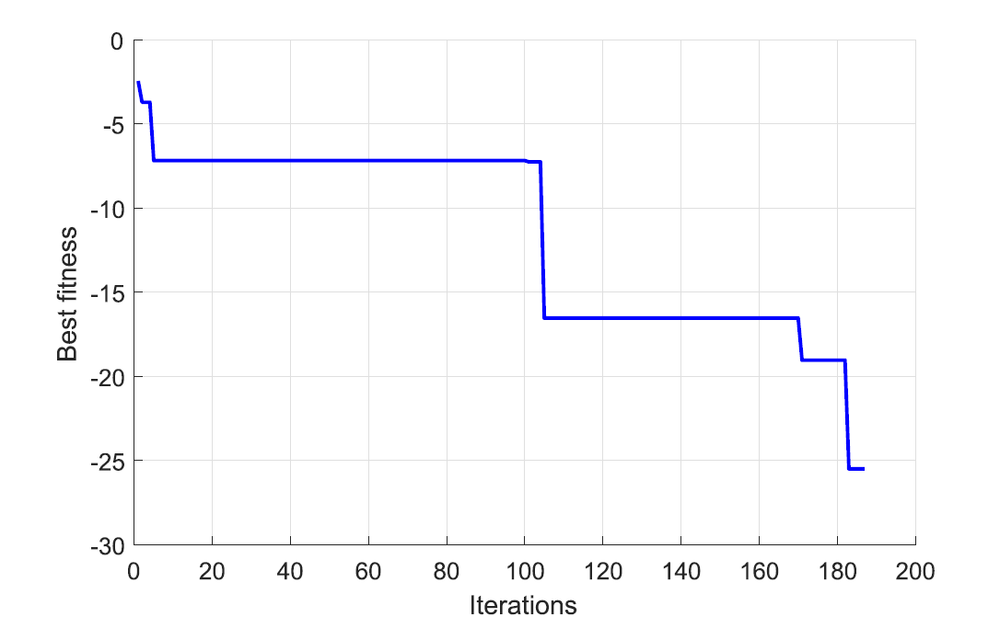
Fig. 7. Convergence curve of BSO for the slotted rectangular
patch antenna optimization.

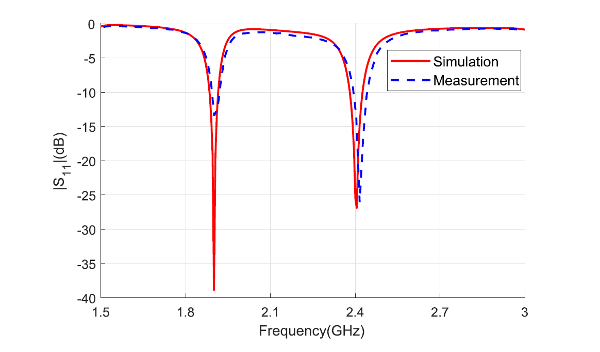
Fig. 8. Simulated and measured $S_{11}$ comparison of the optimized slotted rectangular patch.

## Binary BSO

### BSO: Continuous to Binary

Modified steps:
1. **Grouping Operation**: Since each bit can
be either 0 or 1 in binary space, the Hamming distance
is used to determine the similarity among solutions.
2. **Combining Two Ideas**: a random integer is chosen that
corresponds to the position of a bit in the binary string.
The selected point is used to break the binary strings of
the two ideas, and the selected parts are combined to
form one idea.
3. **Solution Generation**: adding noise to an idea, which
is a string of binary bits, toggles the bit state from 0
to 1 or 1 to 0.

### Example

#### Benchmark

Skip as well

#### Array thining

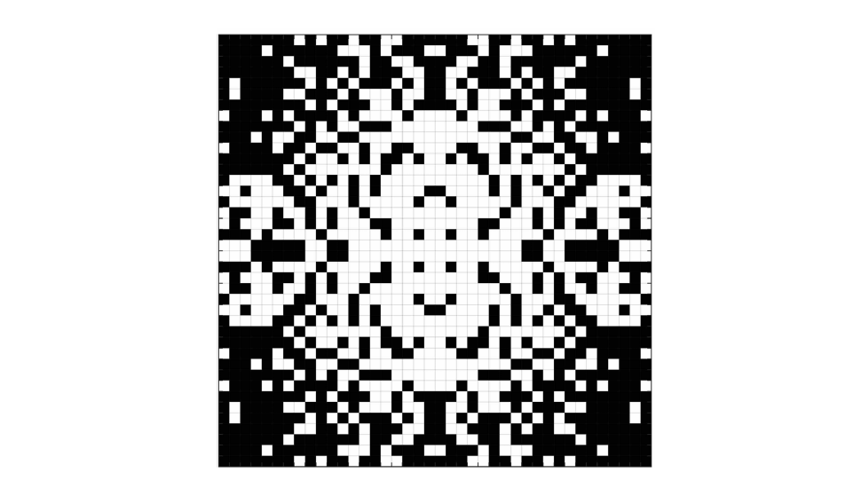
Fig. 9. Optimized design of a thinned 40 × 40 planar array
using BBSO. Elements with ON-state are represented by white
squares, while elements with OFF-state are represented
by black squares.

- **Target**: sidelobe levels
    - lower relative sidelobe levels

#### Pixelated patch

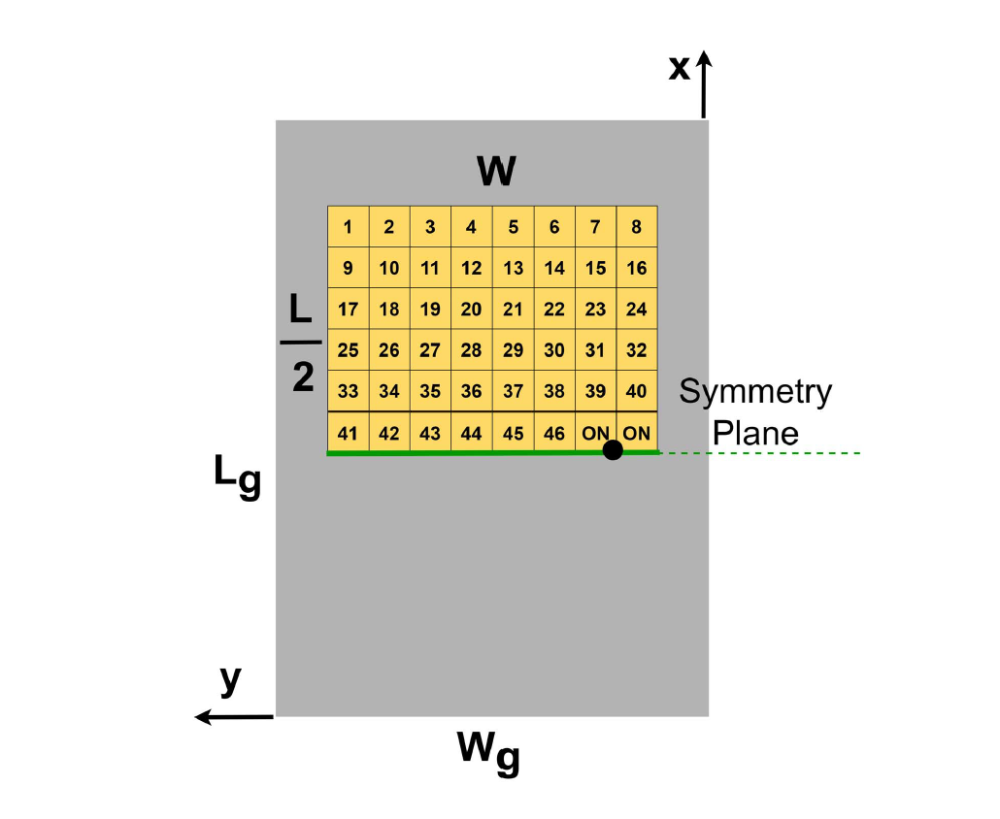
Fig. 10. Process of establishing the optimization problem
starting from a regular patch ending with a 2-D rectangular
array of 46 (on/off) metallic elements with field symmetry
condition along the E-plane.
